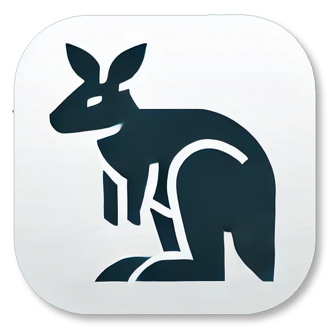

[![Contributors][contributors-shield]][contributors-url]
[![Forks][forks-shield]][forks-url]
[![Stargazers][stars-shield]][stars-url]
[![MIT License][license-shield]][license-url]

<!-- PROJECT LOGO -->
 

  

<h3 align="center">Wallaby</h3>

  

    Generates Apple Wallet passes for different services that do not natively support Apple Wallet.
  

<!-- GETTING STARTED -->

## Getting Started

This project has a few specific dependencies.

### Dependencies

Make sure the following languages are available on your system:

- Java
    - for parsing barcodes with zebra-crossing
    - tested with `openjdk 21.0.4`
    - configurable via JAVA_BIN in .env file
- Python 3
    - for decoding UIC918.9 U_FLEX ASN.1
    - tested with `Python 3.10.12`
    - configurable via PYTHON_BIN in .env file

### Installation

#### Java environment

There is no need to set anything up for Java.

#### Python 3 environment

The application tries to setup the python environment itself. If that doesn't work, here's what to do manually:

1. `cd uic-asn1-parser` cd into the directory
2. `python3 -m venv .venv` Setup your virtual environment
3. `source .venv/bin/activate` Activate the virtual environment
4. `pip install -r requirements.txt` Install python dependencies

(<a href="#readme-top">back to top</a>)

<!-- LICENSE -->

## License

Distributed under the MIT License. See `LICENSE` for more information.

(<a href="#readme-top">back to top</a>)

<!-- CONTACT -->

## Contact

Tii - [@Tii](https://chaos.social/@Tii) - mail@tii.one

Project Link: [https://github.com/tiifuchs/wallaby](https://github.com/tiifuchs/wallaby)

(<a href="#readme-top">back to top</a>)

<!-- MARKDOWN LINKS & IMAGES -->
<!-- https://www.markdownguide.org/basic-syntax/#reference-style-links -->

[contributors-shield]: https://img.shields.io/github/contributors/tiifuchs/wallaby.svg?style=for-the-badge

[contributors-url]: https://github.com/tiifuchs/wallaby/graphs/contributors

[forks-shield]: https://img.shields.io/github/forks/tiifuchs/wallaby.svg?style=for-the-badge

[forks-url]: https://github.com/tiifuchs/wallaby/network/members

[stars-shield]: https://img.shields.io/github/stars/tiifuchs/wallaby.svg?style=for-the-badge

[stars-url]: https://github.com/tiifuchs/wallaby/stargazers

[license-shield]: https://img.shields.io/github/license/tiifuchs/wallaby.svg?style=for-the-badge

[license-url]: https://github.com/tiifuchs/wallaby/blob/master/LICENSE.txt
